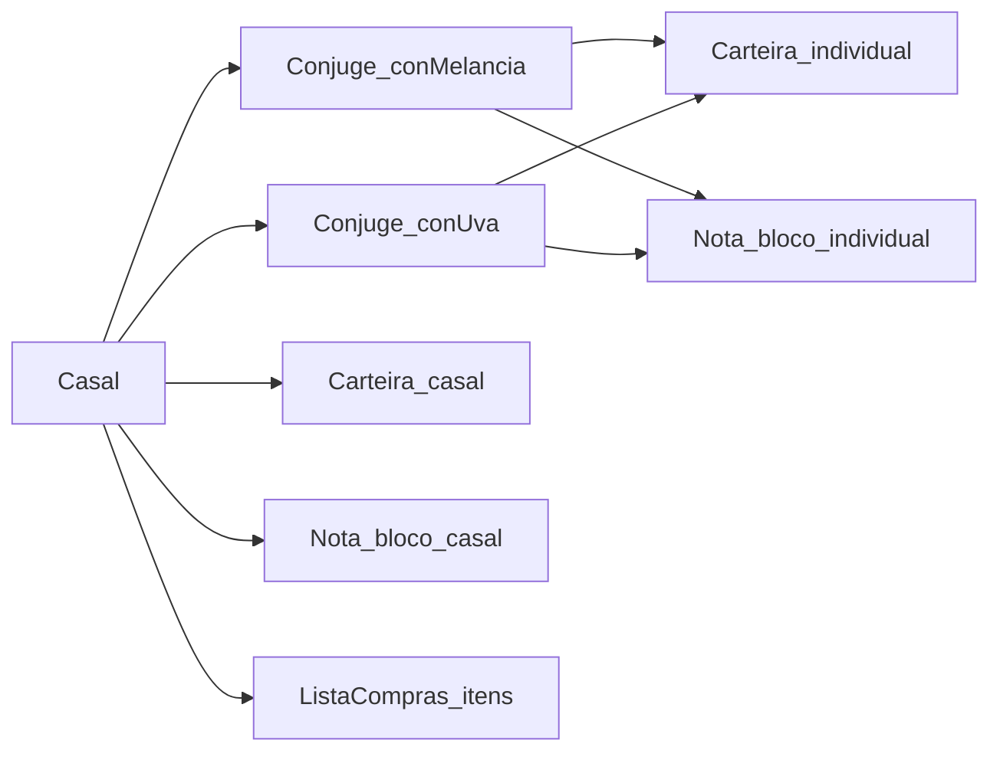

# REGRAS_NEGOCIO_IA.md — NósApp

> Regras de produto e domínio para orientar alterações (humanos e IA). **Em caso de conflito com outros `.md` históricos, prevalecem as entidades em `lib/features/*/domain/entities/` e os datasources em `lib/features/*/data/datasources/`.**

---

## 1. Propósito e público

Este arquivo define **o que o NósApp deve garantir como negócio**: atores, permissões, invariantes e casos limite. Não descreve stack técnica completa (ver [ARQUITETURA.md](ARQUITETURA.md)), nem currículo de estudos ([ROADMAP_NOSAPP.md](ROADMAP_NOSAPP.md)), nem passo a passo de UI ([GUIA_TELAS.md](GUIA_TELAS.md)).

**Documentação legada:** a tabela “Status de implementação” em [ARQUITETURA.md](ARQUITETURA.md) pode estar **desatualizada** em relação ao repositório. Antes de assumir “não implementado”, confira o código.

---

## 2. Produto em uma frase

**NósApp** é um app Flutter para **um casal** (ConMelancia e ConUva) organizar **finanças**, **lista de compras compartilhada** e **notas**, com backend **Supabase** (Auth, dados, Realtime). O escopo alvo do MVP está em [PROJETO.md](PROJETO.md); funcionalidades futuras em “Fase 2” no mesmo arquivo.

---

## 3. Atores e vocabulário

| Nome | Papel |
| --- | --- |
| ConMelancia | Cônjuge 1 (usuário real: Alberto) |
| ConUva | Cônjuge 2 (usuário real: Luan) |
| Casal | Unidade compartilhada (dois cônjuges vinculados) |

No domínio, **cônjuge** é a entidade `Conjuge` (id, nome, email, `casalId`, etc.). **Casal** é a entidade `Casal` com referência explícita aos dois: `conMelancia` e `conUva`.

---

## 4. Modelo mental de tenancy

- Cada **usuário autenticado** corresponde a um **cônjuge** (contas separadas).
- Recursos podem ser **do indivíduo** (identificados por id de cônjuge) ou **do casal** (identificados por id do casal ou por tipo “casal”, conforme o recurso).
- **`casalId`** liga cônjuges ao mesmo casal (ex.: entidade `Conjuge`, e itens de lista com `casalId` em [`item_compra.dart`](../lib/features/lista_compras/domain/entities/item_compra.dart)).
- Isolamento entre **outros** casais (multi-tenant no backend) é responsabilidade de **Auth + políticas/RLS no Supabase**; este documento não substitui revisão de segurança nas queries e políticas.

Regras de contrato/DTO na API (quando houver backend próprio) seguem as convenções do projeto; **domínio não conhece DTO**.

---

## 5. Autenticação (Auth)

- Login com **e-mail e senha** via Supabase Auth.
- **Cadastro self-service** no app (`signUp`): o usuário pode criar conta; se o projeto Supabase exigir **confirmação de e-mail**, a sessão só existe após o link.
- **Onboarding de perfil:** se existir sessão Auth mas ainda **não** houver linhas coerentes em `conjuges`/`casais`, o app exige tela para **criar o cônjuge** (nome + papel ConMelancia ou ConUva) e insere os registros conforme o schema. Ainda é possível criar usuários manualmente no painel Supabase.
- A sessão (`currentUser`) é a base para **filtrar** o que cada um vê no app e para regras no servidor.

**Supabase (validação manual):** ordem de FKs entre `casais` e `conjuges`, políticas RLS de `INSERT` e se `con_melancia_id`/`con_uva_id` podem ser **NULL** até existir o parceiro devem estar alinhadas com o fluxo do app (`AuthRemoteDataSource.completarPerfilInicial`).

---

## 6. Finanças

### 6.1 Carteiras (três no modelo de negócio)

- **Carteira individual ConMelancia** — só quem é dono dessa carteira **lança** nela; impacta saldo individual conforme regra de produto.
- **Carteira individual ConUva** — idem para ConUva.
- **Carteira do casal** — **qualquer um** dos dois pode lançar.

Conceito no código: entidade [`Carteira`](../lib/features/financas/domain/entities/carteira.dart) com `proprietarioId` (id de **Conjuge** ou do **Casal**, conforme desenho) e enum `TipoCarteira` (`individual` | `casal`).

### 6.2 Leitura vs escrita

- **Escrever (lançar):** cada um só lança na **própria** carteira individual; na carteira **do casal**, ambos podem lançar.
- **Ler:** cada um pode **ver** a carteira individual do outro em **somente leitura** (regra de produto em [PROJETO.md](PROJETO.md)). A implementação de listagem/filtro no app deve respeitar isso (ex.: datasource de carteiras combina usuário atual com carteiras do tipo casal — ver seção 12).

### 6.3 Lançamento único

Um mesmo evento financeiro **não** deve ser duplicado em duas carteiras. O lançamento é **um registro** associado a **uma** `carteiraId`.

### 6.4 Tipos de movimento

- `TipoLancamento`: **entrada** ou **saida** (enums no domínio).

### 6.5 Distribuição na carteira do casal

Lançamentos na carteira do casal podem registrar **quanto cabe a cada cônjuge** usando valores **absolutos** (não percentual), via:

- `parteConMelancia: DistribuicaoItem?`
- `parteConUva: DistribuicaoItem?`

Cada `DistribuicaoItem` tem `conjugeId` e `valor` (ver [`lancamento.dart`](../lib/features/financas/domain/entities/lancamento.dart), [`distribuicao_item.dart`](../lib/features/financas/domain/entities/distribuicao_item.dart)).

| parteConMelancia | parteConUva | Significado de negócio |
| --- | --- | --- |
| null | null | Tudo fica no **caixa do casal** (sem fatia pessoal explícita). |
| preenchido | null | Só ConMelancia tem parte declarada; o **restante** permanece no casal. |
| null | preenchido | Só ConUva tem parte declarada; o **restante** permanece no casal. |
| preenchido | preenchido | Distribuição **completa** entre os dois (valores devem ser coerentes com o valor total do lançamento — validação de domínio/UI/backend conforme evolução do projeto). |

**Formato de modelagem:** dois campos opcionais fixos (não uma `List` genérica de tamanho variável), para refletir exatamente dois participantes e evitar validação de tamanho em todo lugar (decisão registrada em [ARQUITETURA.md](ARQUITETURA.md)).

### 6.6 Listagem individual e “incluir casal” (MVP)

Regra de produto: nas visões **individuais**, pode existir filtro **“incluir casal”** para mostrar lançamentos da carteira do casal com **destaque da fatia** de cada um.

**Estado de implementação:** não há referência clara a esse filtro no código atual (`lib/`). Tratar como **requisito de produto** a implementar ou a validar na UI; não assumir que já está pronto.

---

## 7. Lista de compras

- **Uma lista compartilhada** por casal: ambos **adicionam** itens e **marcam** como comprado/concluído.
- A entidade de domínio inclui `id`, `casalId`, `descricao`, `marcado` (ver [`item_compra.dart`](../lib/features/lista_compras/domain/entities/item_compra.dart)). Documentações que citam apenas `id` + `descricao` + `marcado` estão **incompletas**.

---

## 8. Notas

- **Três blocos lógicos de UX:** notas “de ConMelancia”, “de ConUva” e “do casal”.
- **Uma única entidade** `Nota` para todos, com `proprietarioId` apontando para o **id do cônjuge** ou do **casal**, conforme o bloco.
- **Edição:** só o dono edita o bloco individual; o bloco do casal é editável por **ambos**.

Arquivo de referência: [`nota.dart`](../lib/features/notas/domain/entities/nota.dart).

---

## 9. Invariantes que a IA não deve quebrar silenciosamente

1. **Domain não importa** Data nem Presentation ([ARQUITETURA.md](ARQUITETURA.md)).
2. **Sem** classe abstrata genérica `Proprietario` no MVP — dono de recurso via `proprietarioId` + `TipoCarteira` onde aplicável.
3. **Distribuição** em lançamento do casal: manter **dois** campos opcionais (`parteConMelancia` / `parteConUva`), não substituir por lista genérica sem decisão explícita de produto.
4. **Lançamento único** — não modelar o mesmo gasto/recebimento como dois lançamentos em carteiras diferentes para “duplicar” efeito.
5. **Notas:** não misturar blocos sem usar `proprietarioId` de forma consistente com a regra de edição acima.
6. **Banco:** alterações de schema **manuais** (não automatizar migrações pelo assistente sem alinhamento); este doc não define colunas SQL.

---

## 10. Fora do MVP (Fase 2)

Exemplos: tarefas compartilhadas, histórico de tarefas, resumo financeiro mensal, notificações. Detalhes em [PROJETO.md](PROJETO.md).

---

## 11. Manutenção deste arquivo

Sempre que uma **regra de negócio** mudar:

1. Atualizar **este** arquivo.
2. Revisar [PROJETO.md](PROJETO.md) e [ARQUITETURA.md](ARQUITETURA.md) se a mudança afetar escopo ou modelo canônico.
3. Se o time usar arquivos CONTEXT no futuro, alinhar o mesmo conteúdo lá.

---

## 12. Verificação com o repositório (pontos sensíveis)

Ao alterar regras de finanças ou visibilidade, reler:

| Área | Arquivo sugerido |
| --- | --- |
| Carteira e lançamento (domínio) | [`lib/features/financas/domain/entities/`](../lib/features/financas/domain/entities/) |
| Filtro de carteiras / lançamentos | [`lib/features/financas/data/datasources/financas_remote_datasource.dart`](../lib/features/financas/data/datasources/financas_remote_datasource.dart) (ex.: `buscarCarteiras` usa `proprietario_id` do usuário atual **ou** `tipo == casal`) |
| Itens de compra | [`lib/features/lista_compras/data/datasources/lista_compras_remote_datasource.dart`](../lib/features/lista_compras/data/datasources/lista_compras_remote_datasource.dart) e RLS no Supabase |
| Notas | [`lib/features/notas/data/datasources/notas_remote_datasource.dart`](../lib/features/notas/data/datasources/notas_remote_datasource.dart) |
| Injeção / providers | [`lib/injection_container.dart`](../lib/injection_container.dart) |

---

## 13. Diagrama de relações (domínio)

---

## 14. Documentos relacionados

| Documento | Uso |
| --- | --- |
| [PROJETO.md](PROJETO.md) | Escopo, usuários, MVP vs Fase 2 |
| [ARQUITETURA.md](ARQUITETURA.md) | Pastas, camadas, decisões de modelagem |
| [GUIA_TELAS.md](GUIA_TELAS.md) | Providers, telas, padrões de UI |
| [ROADMAP_NOSAPP.md](ROADMAP_NOSAPP.md) | Estudo e ordem de conceitos |
| [SESSAO.md](SESSAO.md) | Diário de sessão (pode estar defasado) |
